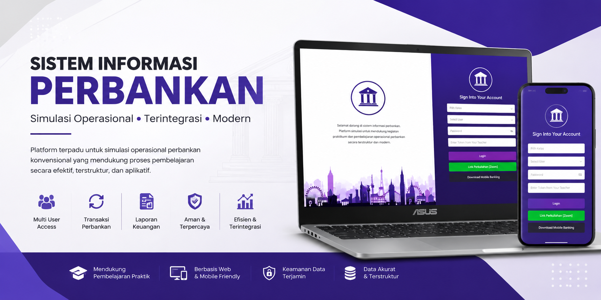
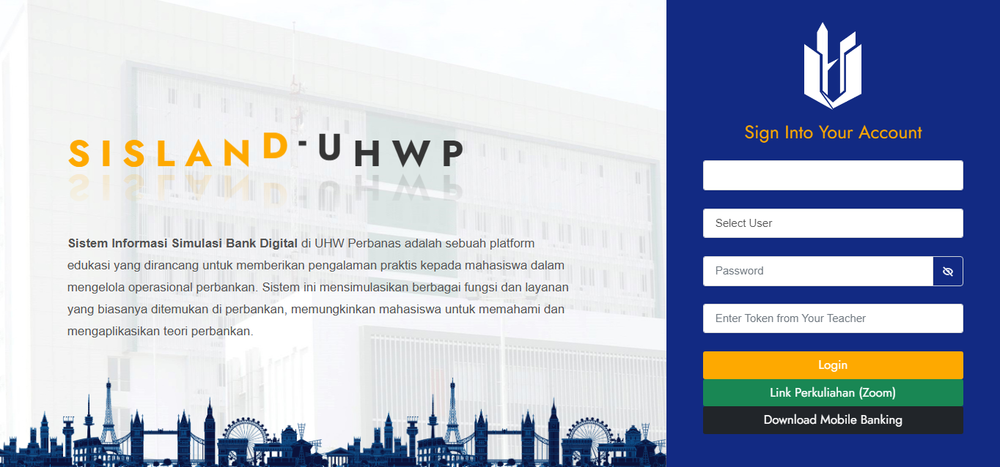
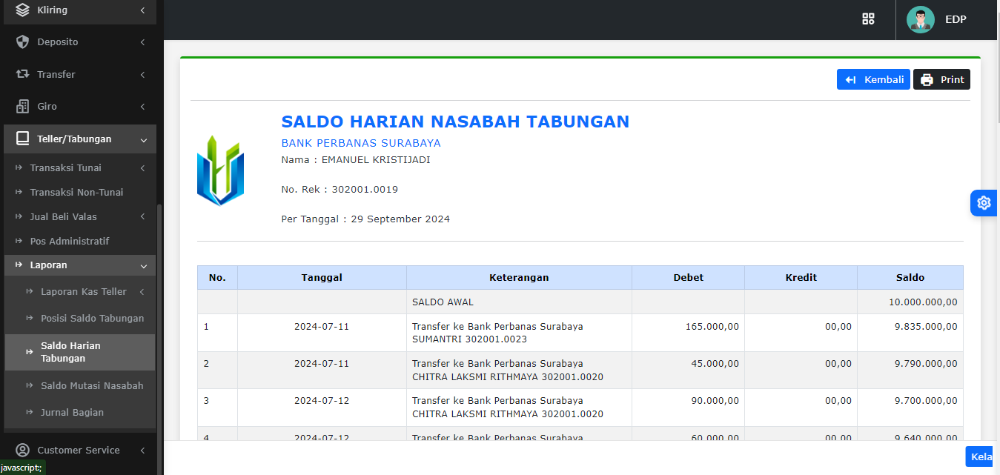
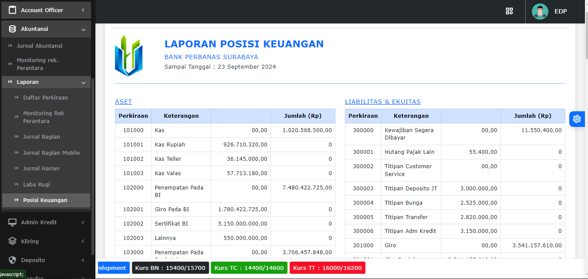

# Bank Management System (SHOWCASE)
   

  

Aplikasi ini merupakan **showcase / demo project** yang digunakan untuk portofolio.  
Beberapa data dan fitur mungkin tidak sepenuhnya lengkap atau disederhanakan untuk kebutuhan portofolio.

Sistem informasi perbankan berbasis web yang dirancang untuk mendukung proses pembelajaran operasional perbankan konvensional secara terintegrasi, modern, dan aplikatif. Sistem ini dikembangkan sebagai media simulasi praktik perbankan bagi mahasiswa, dosen, maupun laboran agar proses pembelajaran tidak hanya bersifat teoritis tetapi juga memberikan pengalaman operasional yang menyerupai dunia kerja nyata.

---

## Tentang Project

Bank Management System membantu proses simulasi berbagai aktivitas operasional perbankan konvensional seperti pembukaan rekening, transaksi tabungan, pengelolaan deposito, pencatatan jurnal transaksi, hingga penyusunan laporan keuangan. Sistem ini dirancang untuk mendukung kegiatan laboratorium perbankan agar proses pembelajaran menjadi lebih efektif, terstruktur, dan fleksibel.

Selain digunakan sebagai media pembelajaran, sistem ini juga mendukung pengelolaan administrasi laboratorium perbankan melalui pengaturan hak akses pengguna, monitoring aktivitas praktikum, dan integrasi data pembelajaran dalam satu platform terpusat.

---

## Fitur Utama

* Manajemen data nasabah
* Pembukaan rekening tabungan
* Transaksi setoran dan penarikan tunai
* Simulasi transfer antar rekening
* Pengelolaan deposito
* Jurnal transaksi keuangan
* Laporan saldo harian nasabah
* Laporan posisi keuangan
* Manajemen hak akses pengguna
* Simulasi kredit bank
* dll

---

## Teknologi yang Digunakan

* PHP
* Laravel Framework
* MySQL
* Bootstrap
* JavaScript

---

## Screenshot

### Login Page

  

### Laporan Saldo Harian Nasabah Tabungan

  

### Laporan Posisi Keuangan

  

---

## Role Play

* Administrator
* Account Officer
* Admin Kredit
* Akuntansi
* Customer Service
* Deposito
* EDP
* Export Import
* Giro
* Kliring
* Teller
* Transfer
  
---
## Status

Project aktif dikembangkan untuk kebutuhan simulasi laboratorium perbankan.
